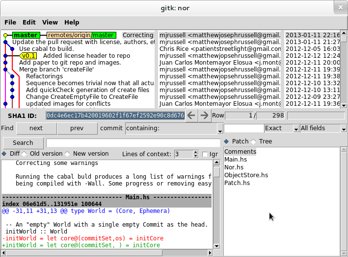

% Using Git: An Overview for Comp 20
% Hashem Nasarat
% February 4, 2013

What is git?
------------

* Git: Version Control System (VCS)
* Distributed: Lives on more than one computer
* Keeps track of snapshots of a directory: [VCS] repository = files + history
* [Free software](http://www.gnu.org/philosophy/philosophy.html)
* Really complex (300,000 lines of code, written in C, Bash, and Perl)
* Really useful (helps keep track of what you do, so you make fewer mistakes)
* Started by the Linus Torvals, who also started the Linux kernel
* Git $\neq$ GitHub, though [Git's code](https://github.com/git/git) is
  available there.

Using Git
---------

* Read the manual
* `git help` *\<command\>*
    * Warning: the documentation is pretty gross
* The following are the most useful bits of git knowledge I've picked up over
  the years.

Git: Local Repository Only
==========================

Basic Usage (local repository)
------------------------------
> * `git init` -- Create a repository

~~~~~~~~~~~~~~~~~~~
    repo   files
     ___
    [   ]   *
    [___]
~~~~~~~~~~~~~~~~~~~

* `git add` -- I want you to record the state of the following files

~~~~~~~~~~~~~~~~~~~
     ___
    [ * ]
    [___]
~~~~~~~~~~~~~~~~~~~

* `git commit` -- Actually do it. (And attach a message describing changes)

~~~~~~~~~~~~~~~~~~~
     __________________
    [ * (HEAD) message ]
    [__________________]
~~~~~~~~~~~~~~~~~~~
* __HEAD__: the current commit

Basic Usage (local repository)
------------------------------
> * *rinse, repeat*

~~~~~~~~~~~~~~~~~~~
     ___________________
    [ * (HEAD) message3 ]
    [ * message2        ]
    [ * message         ]
    [___________________]
~~~~~~~~~~~~~~~~~~~

Git: Local and Remote Repositories
==================================

Basic Usage (local + remote repository)
---------------------------------------
* Git repositories can be synchronized between multiple local and multiple remote computers (e.g. your laptop, halligan, and GitHub).
    * A repository's `.git/config` file has details
    * Default remote name is `origin`
    * *git remote add origin https://github.com/Hnasar/test.git*
* GitHub offers public remote repositories
* Local and remote repositories has benefits:
    * Work on stuff without an Internet connection
    * Work on a project from different computers
* Added complexity:
    * Manually keep changes synchronized.
    * Combining some changes requires intervention (a conflict)

Remote: Initial State
---------------------
> * Empty remote, new repository

~~~~~~~~~~~~~~~~~~~
     local           remote
    (laptop)        (GitHub)
     ____            ____
    [ *  ]          [    ]
    [ *  ]          [    ]
    [ *  ]          [    ]
    [____]          [____]
~~~~~~~~~~~~~~~~~~~

Remote: Updating the remote
---------------------------
> * Update the remote with local changes with `git push`

~~~~~~~~~~~~~~~~~~~
     local           remote
    (laptop)        (GitHub)
     ____    push    ____
    [ *  ]  ----->  [ *  ]
    [ *  ]          [ *  ]
    [ *  ]          [ *  ]
    [____]          [____]
~~~~~~~~~~~~~~~~~~~

* (DANGEROUS if the remote repo gets completely messed up, try `git push -f`
  It's usually better to resolve conflicts rather than do this. This can lead
  to lost data)

Remote: Creating a new local
----------------------------
> * Download an entire remote repository to a new local copy with `git clone`

~~~~~~~~~~~~~~~~~~~
     local           remote         local
     (laptop)       (GitHub)        (halligan)
     ____            ____    clone    ____
    [ *  ]          [ *  ]  ------>  [ *  ]
    [ *  ]          [ *  ]           [ *  ]
    [ *  ]          [ *  ]           [ *  ]
    [____]          [____]           [____]
~~~~~~~~~~~~~~~~~~~

Remote: Updating the local
----------------------------
> * Update local repositories with remote changes with `git pull`

~~~~~~~~~~~~~~~~~~~
     local           remote         local
     (laptop)       (GitHub)        (halligan)
     ____            ____             ____
    [ *  ]  (push)  [ *  ]   pull    [ *  ]
    [ *  ]  ----->  [ *  ]  ------>  [ *  ]
    [ *  ]          [ *  ]           [ *  ]
    [ *  ]          [ *  ]           [ *  ]
    [____]          [____]           [____]
~~~~~~~~~~~~~~~~~~~

* *`git pull` is usually bad form. Use `git pull --rebase`*
* Read [this article](http://blog.experimentalworks.net/2009/03/merge-vs-rebase-a-deep-dive-into-the-mysteries-of-revision-control/) for more info.

Interlude: Setting up GitHub User Pages
----------------------------------------
* User pages: a GitHub feature that exposes a specific repository in your account as a website.
* Email account must be verified.
* Repository must be named: *username*`.github.com`
* 10 minutes needed before the page will load
* If you can't get it to work, delete the repo and recreate it.
* E.g. My GitHub username is *hnasar*. My "User Pages" repository is called
  `hnasar.github.com`, and it's accessible [here](http://hnasar.github.com/)

Viewing a Repository 1
----------------------
* `gitk --all`
* 
* available on halligan, Ubuntu/Debian,
  [homebrew](http://mxcl.github.com/homebrew/)

Viewing a Repository 2
----------------------
* `git log --graph --oneline --all --decorate`
* mnemonic: (git log g.o.a.d.), goad, meaning it's annoying to type all that
* (Shortcut: `Ctrl + r`, then start typing `git log --graph` ...)
* 

What next?
----------
* Lots of potential topics. What are you interested in?
* Committing and good commit style
* Undoing commits and fixing things
* Working with branches
* GitHub forking and pull requests
* Time travel
* Questions from the audience

Committing and Good Commit Style
================================

Adding and Committing
---------------------
* Commits are the basic unit of a repository
* Mark a new state of files at a point in time
* Commit message message indicates to viewers what the changes in the commit did.
* (Use `git diff` to see what was changed from the last commit)
* 2-part command
    1. `git add` *\<path[s]\>* -- record these changes in the next commit
    2. `git commit` -- make the commit, and add a message

* (try `git add -p` to select exactly which changes within files are added)
* Before a commit is made, `git reset` (without any arguments!) will undo `git add`
* `git commit` (with no arguments) will open *vim*. To save and quit, type `:wq`

Commit Style
------------
> * A good commit will contain only the changes necessary to some new feature
  of a repository.
  
* E.g. If the feature is: "ensure all `img` tags have an `alt` attribute", a good commit will add `alt` tags for every `img` in one go, and NOT create a new commit for every changed `img` tag, or every file that I change things in.

* Good commit message form:
    * Feature in present tense
    * One blank line
    * Explanation/reasoning of changes

~~~~~~~~~~~~~
Add alt attribute to every img

As per Section 508 Amendment to the Rehabilitation Act of 1973
and the HTML 5 specification, every img should have an alt
attribute which "provides equivalent content for those who
cannot process images or who have image loading disabled".
~~~~~~~~~~~~~

Undoing Commits and Fixing Things
=================================

Git reset
---------
* `git reset --hard` *\<commit\>* 
    * DANGEROUS -- you will lose any __uncommitted__ changes
    * used to undo commits
    * Moves branch label, and HEAD to commit specified

Git reset example
-----------------

~~~~~~~~~~~~~~~
    * 31a3f57 (HEAD, master) Third commit
    * 20ea82d Second commit
    * 9ef5cfb First commit
~~~~~~~~~~~~~~~
* `git reset --hard 20ea82d`

Git reset example
---------------

~~~~~~~~~~~~~~~
    * 20ea82d (HEAD, master) Second commit
    * 9ef5cfb First commit
~~~~~~~~~~~~~~~

Un-undoing Commits
------------------
> * Commits are only truly deleted after a given time passes (several days)

* `git reflog`
    * displays most recent commits which have been HEAD

~~~~~~~~~~~~~~~
    20ea82d HEAD@{0}: reset: moving to HEAD~1
    31a3f57 HEAD@{1}: checkout: moving from 20ea82d to master
    20ea82d HEAD@{2}: checkout: moving from master to HEAD~1
    31a3f57 HEAD@{3}: commit: Third commit
    20ea82d HEAD@{4}: commit: Second commit
    9ef5cfb HEAD@{5}: commit (initial): First commit
~~~~~~~~~~~~~~~
* `git reset --hard 31a3f57`

Un-undoing Commits
---------------
> * *Back to the start!*

~~~~~~~~~~~~~~~
    * 31a3f57 (HEAD, master) Third commit
    * 20ea82d Second commit
    * 9ef5cfb First commit
~~~~~~~~~~~~~~~

Working with Branches
=====================

Branches
--------
> * Branches allow multiple lines of commits, which may be dealing with
  differing features, to not overlap (which might cause confusion).

* A branch is a label attached to a commit.
* Default branch name is `master`
* View branches (including the current one) with `git branch -a`

~~~~~~~~~~~~~~~~~
      * 7a0fc15 Patch.hs: Fix incorrect editsToChangeHunks offsets
      * e564f63 Make the type of Edit more general.
    * | 0bbe999 Implements applyPatch
    * | b6d7003 Implements sequencePatches
    |/
    * 6f2a864 Paralell patch changes
~~~~~~~~~~~~~~~~~

Using Branches
--------------
* Create a branch with `git branch` *\<branch-name\>*
* Delete a branch with `git branch -d` *\<branch-name\>*
* Switch branches with `git checkout` *\<branch-name\>*
* When you commit, the new commit's parent is the tip of the current branch,
  and the branch will now point to the new commit.
* [A successful Git branching model](http://nvie.com/posts/a-successful-git-branching-model/)

Combining Branches
------------------
1. `git merge` *\<branch to merge in\>*
    * Produces a commit with multiple parents

~~~~~~~~~~~~~~~~~~
    *   ca5ac46 Merge branch 'master' of github.com:jmont/nor
    |\
    | * 7a0fc15 Patch.hs: Fix incorrect editsToChangeHunks offsets
    | * e564f63 Make the type of Edit more general.
    * | 0bbe999 Implements applyPatch
    * | b6d7003 Implements sequencePatches
    |/
    * 6f2a864 Paralell patch changes
~~~~~~~~~~~~~~~~~~

2. `git rebase` *\<branch to rebase onto\>*
    * Removes the branch by making the branch's commits stem from the end of
      the other.

~~~~~~~~~~~~~~~~~~
    * 7a0fc15 Patch.hs: Fix incorrect editsToChangeHunks offsets
    * e564f63 Make the type of Edit more general.
    * 0bbe999 Implements applyPatch
    * b6d7003 Implements sequencePatches
    * 6f2a864 Paralell patch changes
~~~~~~~~~~~~~~~~~~

Conflicts
---------
* Git is smart about what lines changed in which files in a commit
* Some commits indicate contradicting changes.
* If git can't figure it out, it writes both version the file, complains of a
  conflict and tells you to fix it.
* Make the file look how you want, then do `git add .` and `git commit`

GitHub Forking and Pull Requests
================================

GitHub: Forking
---------------
> * GitHub "Forking" is something GitHub invented (not a part of git)

* GitHub "Forking" is a way to copy a remote git repo from one GitHub user to another.
* "fork" typically means taking an existing project, and developing it in a new direction. This is what happened when LibreOffice forked from OpenOffice and Ubuntu from Debian.

~~~~~~~~~~~~~~~~~~~
     remote          remote
     tuftsdev/       hnasar/
     running-dogs    running-dogs
     ____            ____
    [ *  ]   fork   [ *  ]
    [ *  ]  ----->  [ *  ]
    [ *  ]          [ *  ]
    [____]          [____]
~~~~~~~~~~~~~~~~~~~

GitHub: Pull Request
--------------------
> * Typically, free software software developers share patches (modifications to code, try `git format-patch` *\<commit\>*) via email or posting on websites. 

* GitHub created a notion of a "Pull Request" to easily allow GitHub "Forked"
  projects to collaborate in a similar fashion as sharing patches.
* [Good explanation](http://beust.com/weblog/2010/09/15/a-quick-guide-to-pull-requests/)
* Pull Requests must be accepted by the recipient. 

~~~~~~~~~~~~~~~~~~~
     remote          remote
     tuftsdev/       hnasar/
     running-dogs    running-dogs
     ____           ____
    [_*__] <------ [ *  ]
    [ *  ]   pull  [ *  ]
    [ *  ] request [ *  ] 
    [ *  ]         [ *  ] 
    [____]         [____]
~~~~~~~~~~~~~~~~~~~

GitHub: No passwords
---------------------
* Possible to use GitHub without typing in username & password each time
* [Set up SSH keys](https://help.github.com/articles/generating-ssh-keys#platform-windows)
* Make sure that your remote URIs are set to `git@github.com/`...
* 
* Check a repository's `.git/config` file

Time Travel
===========

Checkout & Blame
----------------
* checkout moves HEAD (the current commit, and the corresponding state of the
  files)
* (remember `git log --graph --oneline --all --decorate`)
* `git checkout` *\<commit-hash\>* (e.g. `git checkout 0dc4e6e`)
    * 'detached HEAD' state, which means HEAD isn't on a branch
    * `git checkout` a branch to "reattach" the HEAD
* `git blame` *\<file\>* to see when and who last made changes to a part of a
  file.  
* `git show` *\<commit\>* displays the contents of a given commit.

End
===

Questions/Comments
------------------
* More reference available [here](http://tuftsdev.github.com/WebProgramming/#references)
* Still unclear?
* Did I miss something?

